## Live Link
[https://weatherwatch.herokuapp.com/](https://weatherwatch.herokuapp.com/)

## Table of Contents
 - [App Goals](#app-goals)
 - [User Stories](#user-stories)
   * [First Time User](#first-time-user)
   * [Returning Users](#returning-users)
 - [Design Goals And Features](#design-goals-and-features)
   * [Design Flow](#design-flow)
   * [Landing Screen](#landing-screen)
   * [24 Hour And 7 Day Forecast](#24-hour-and-7-day-forecast)
   * [Historical Weather Data](#historical-weather-data)
   * [Hottest And Coldest Days](#hottest-and-coldest-days)
   * [Changes In Weather](#changes-in-weather)
 - [Testing Results & Known Issues](#testing-results--known-issues)
   * [CI Linter Testing](#ci-linter-testing)
   * [Bugs](#bugs)
     - [Solved Issues](#solved-issues)
 - [Deployment](#deployment)
  * [Heroku](#heroku)
 - [Technologies Used](#technologies-used)
  * [Python Libraries](#python-libraries)
 - [Credits](#credits)
  * [Code](#code)
 
 
## App Goals

WeatherWatch is a Python based command-line interface which allows users to access both upcoming weather forecasts and also historical weather data trends. The app would be intended for both day-to-day use with regular users being able to access the upcoming weather forecast for any location they would need and also for informational purposes, with the historical data being useable to understand how changes in the environment can affect the weather over time for a given area.

## User Stories

### First Time User

 1. As a first time user, I want to be able to easily understand the aims and use of the app
 2. As a first time user, I want to clearly understand how to interact with the app's content
 3. As a first time user, I want to be able to access the data I need quickly and easily and have it presented in a clear and understandable format

### Returning User

 1. As a returning user, I would like to be able to check new forecasts quickly and easily
 2. As a returning user, I would like to be able to check other locations weather from both a future and historical standpoint(i.e. for travel purposes)

## Design Goals And Features 

### Design Flow

  
User Experience Flowchart

  
  #### User Experience Flowchart
  
  
  

  
  #### Landing Screen
  
  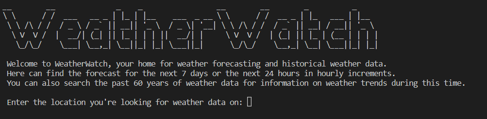
  
  Upon loading users are greeted with the landing screen logo and the introductory text. Users are given a brief overview of the information they can receive through the app and are then prompted to enter the location they are looking for. Once the information is entered, the entry is passed for validation and if invalid, they are informed of this and asked to re-enter the location data. If valid then the selection menu is shown to the user as follows:
  
  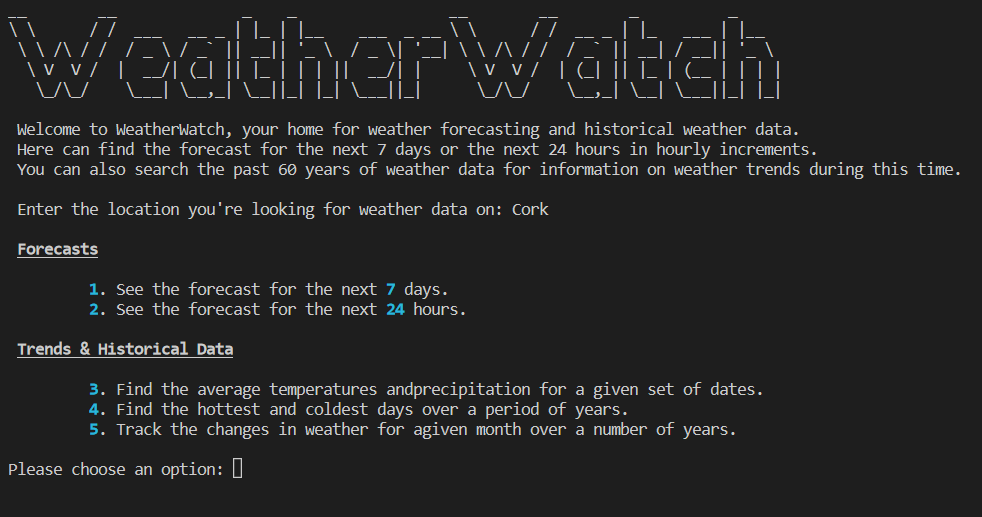
  
  When the menu is shown, each item gives a brief description of what they do and the user is then prompted for their selection from the numbered list. This selection is then validated and if valid, then the requested selection is generated. If invalid, once again the user is prompted to re-enter their selection.
  
  #### 24 Hour and 7 Day Forecasts
  
  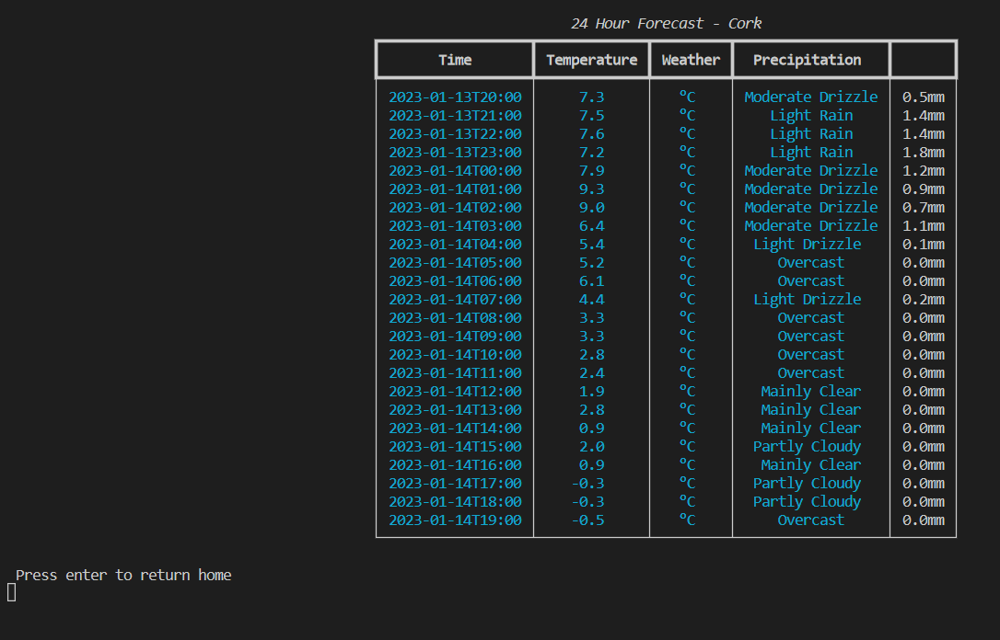
  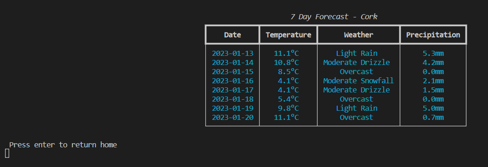 
  
  The 24-Hour and 7-Day Forecasts allow the user to see the upcoming weather data in an easily readable table, showing clearly the date/time, temperature, weather and expected rain/snow fall. While the weather data returned from the Open Meteo represents the upcoming weather type as a numerical weathercode, these weathercodes are converted into understandable forecasts prior to being added to the table.
  
  #### Historical Weather Data
  
   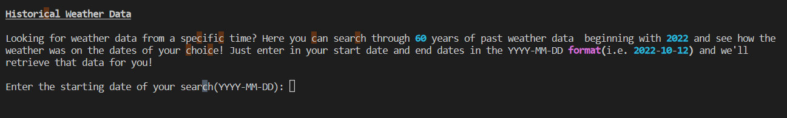
   
   The Historical Weather Data section allows users to input a start date and end date for any period during the 60 years of weather data available through the Historical Weather API. The user is guided through on how to provide the correct format for the dates and their entry will be validated after they have completed the prompts, if invalid they'll be reprompted while being provided the values of the incorrect entries that were made which proved invalid.
   
   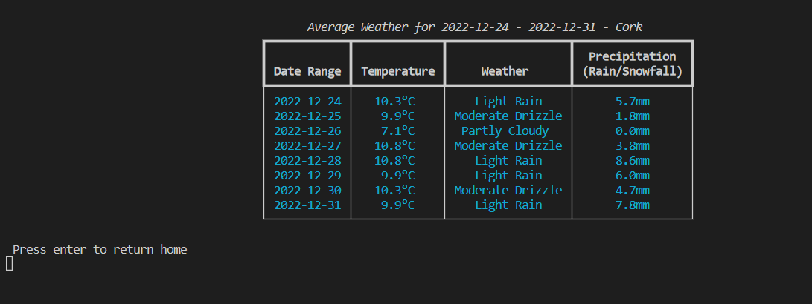
   
   Once validated, the request is passed to the Historical Weather API and the returned data is output as a table by date showing the range they entered and the results by date, giving the user the temperature, weather and precipitation data in a similar manner to the forecast data.
  
  #### Hottest And Coldest Days
  
  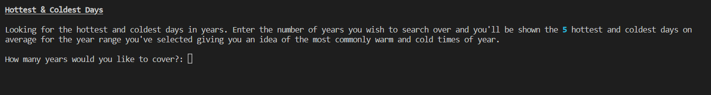
  
  Upon selecting this option, users are initially presented with an extended explanation of what this option is intended for, giving users the ability to search for the hottest and coldest days of a range of years. They are then prompted to enter the number of years they wish to explore and if valid, the timeframe is generated and the query is passed.
  
  As the date format is constant in the data returned we are able to remove the year from the dates returned and subsequently create a list of individual dates and their associated temperatures. These days are then totalled and averaged then sorted from highest to lowest. This data is then iterated upon to create the following table showing the 5 hottest and coldest days on average giving users a general idea of what days tend towards high and low temperatures over a given period.
  
  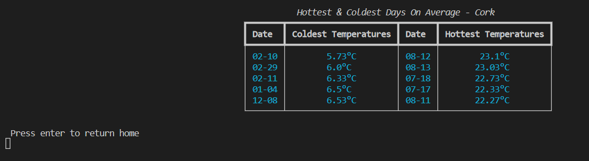
  
  #### Changes In Weather
  
  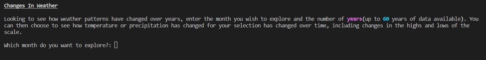
  
  The trends in weather option gives users the ability to see changes in weather for a given month over a number of years which as an informational tool allows users to see how environmental changes over years has affected the weather patterns of an area. Users are prompted to enter the month they wish to view the data for followed by the number of years. These options are both tested for validity and if successful, users are then prompted to select which set of data they wish to view as in the following screenshot.
  
  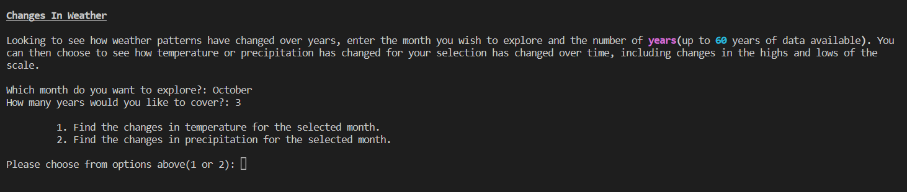
  
  With a valid query from the user, they are then shown the option to select between seeing temperature changes or precipitation changes over time. When the selection is chosen, the selected data is then pulled from the data returned from the API query and then the following table is generated.
  
  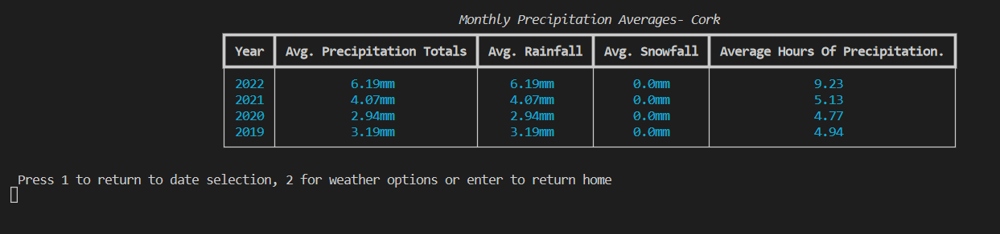
  
  After the table is generated, the user is given multiple choices on how to proceed, they can return to the initial menu to change the month/number of years explored, to return to the previous menu to change the weather data being shown or to return home to the main menu.
  
  

## Device Testing Results & Known Issues

### CI Linter Testing

  
run.py - Linter Results

  
  #### run.py - Linter Results
  
  

### Bugs

#### Solved Issues

1. Initially the Google Geocoding API was being used to convert the location provided by the user, however when testing with certain non-specific locations(i.e. Cork, Bray), no result was being found. In place of the Geocoding API the Google Places API was used in its place which remedied the issue.

## Deployment

### Heroku

1. From the Heroku dashboard choose to create a new app, from there you'll need to provide a unique ID for the app which will be used for the app URL.
 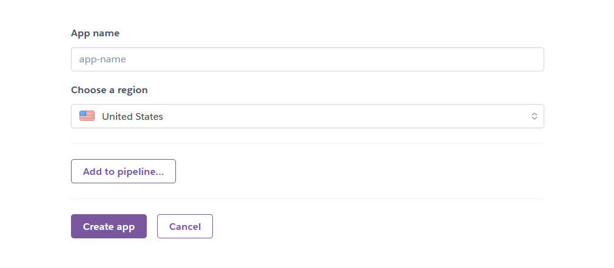
2. After the app is created, you will want to choose Github as the deployment method and then authorize access to the Github account where the code is based.
3. Once authorized, search for the Github project name and then connect to the correct project.
 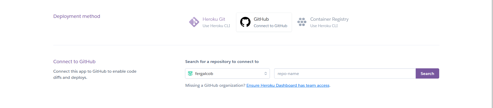
4. When connected, enable automatic deploys and choose the correct branch for your deployment.
 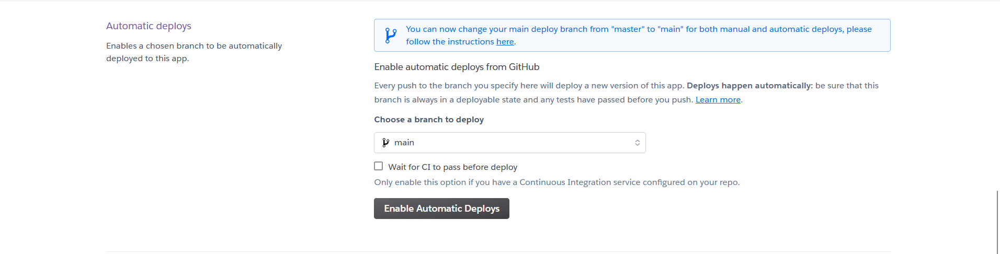
5. From the settings tab, ensure that the Python and NodeJS buildpacks are added and that port 8000 is added to the config Vars list also.
 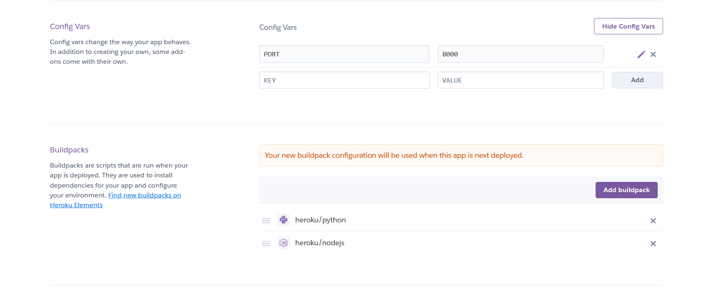
6. On next push to github, the code will be built automatically and the project will be available at https://<project-name>.herokuapp.com/

## Technologies Used

[Python](https://www.python.org/) - Main language used in the project for all aspects

[Diagrams.net](https://www.diagrams.net/) - Used to design the flowchart in the README file

[Heroku](https://www.heroku.com/) - For deploying the finished code

### Python Libraries

[Google Maps](https://github.com/googlemaps/google-maps-services-python) - Used to retrieve the latitude and longitude of the locations entered by users via the Google Places API

[openmeteo_py](https://github.com/m0rp43us/openmeteopy) - Used to retrieve the weather data from Open Meteo's API

[art](https://github.com/sepandhaghighi/art) - Used to generate the WeatherWatch logo art

[readchar](https://github.com/magmax/python-readchar) - Used to monitor keypresses in order for return home functions to be called

[rich](https://github.com/Textualize/rich) - Used in formatting of the weather tables and styling of the text

### Resources

[Open Meteo](https://open-meteo.com/) - Free API used in this project with access to both current and historical weather data

[Rich Documentation](https://rich.readthedocs.io/en/stable/) - Helped in the use of the Rich library for styling and table creation

[W3Schools](https://www.w3schools.com/python/default.asp) - General documentation on Python syntax

[PyPI](https://pypi.org/) - Used for finding specific Python libraries to meet the project needs

## Credits
### Code

The OWmanager_historical class found in the historical_data.py file is based on the OWmanager class found in the [openmeteopy](https://github.com/m0rp43us/openmeteopy) library. The current version of this library does not currently support querying OpenMeteo's Historical Weather API and so this class needed to be updated in order to query the Historical API endpoint. Additional parameters(Start Dates & End Dates) needed to be passed to the historical class and so additional testing needed to be added to this class also to ensure that the new data provided returned a valid query.
