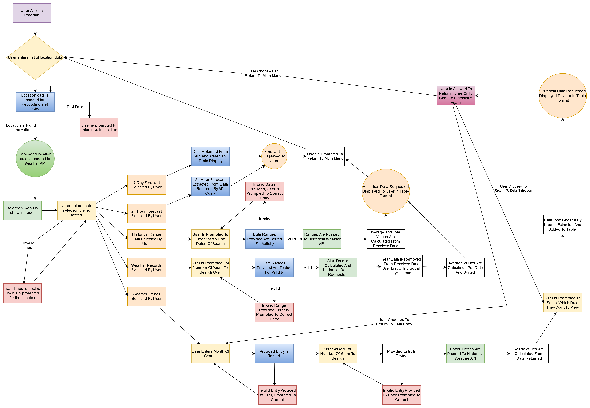
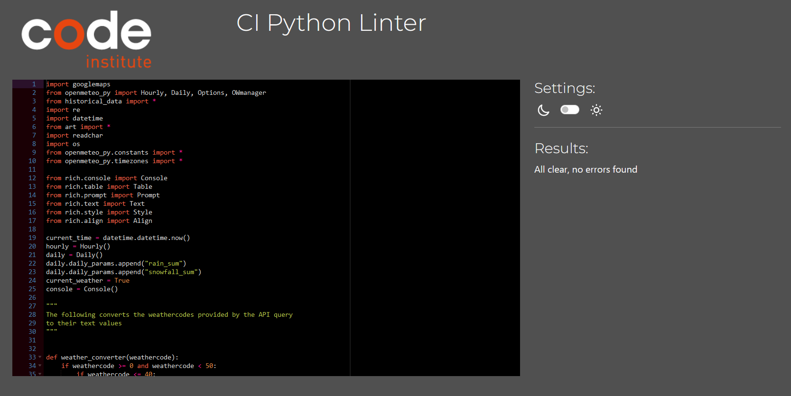

## Live Link
[https://fergalcob.github.io/CiNAMEa/](https://fergalcob.github.io/CiNAMEa/)

## Table of Contents
 - [App Goals](#app-goals)
 - [User Stories](#user-stories)
   * [First Time User](#first-time-user)
   * [Returning Users](#returning-users)
 - [Design Goals And Features](#design-goals-and-features)
   * [Design Flow](#design-flow)
 - [Device Testing Results & Known Issues](#device-testing-results--known-issues)
   * [Devices & Browsers Used For Testing](#devices--browsers-used-for-testing)
   * [CI Linter Testing](#ci-linter-testing)
   * [Bugs](#bugs)
     - [Solved Issues](#solved-issues)
 - [Deployment](#deployment)
  * [Github Pages](#github-pages)
 - [Technologies Used](#technologies-used)
  * [Python Libraries](#python-libraries)
 - [Credits](#credits)
  * [Code](#code)
 
 
## App Goals

WeatherWatch is a Python based command-line interface which allows users to access both upcoming weather forecasts and also historical weather data trends. The app would be intended for both day-to-day use with regular users being able to access the upcoming weather forecast for any location they would need and also for informational purposes, with the historical data being useable to understand how changes in the environment can affect the weather over time for a given area.

## User Stories

### First Time User

 1. As a first time user, I want to be able to easily understand the aims and use of the app
 2. As a first time user, I want to clearly understand how to interact with the app's content
 3. As a first time user, I want to be able to access the data I need quickly and easily and have it presented in a clear and understandable format

### Returning User

 1. As a returning user, I would like to be able to check new forecasts quickly and easily
 2. As a returning user, I would like to be able to check other locations weather from both a future and historical standpoint(i.e. for travel purposes)

## Design Goals And Features 

### Design Flow

  
User Experience Flowchart

  
  #### User Experience Flowchart
  
  

## Device Testing Results & Known Issues

### Devices & Browsers Used For Testing

1. Laptop(Acer Nitro 5 & Lenovo Ideapad 5)
    * Chrome
    * Edge
    * Firefox

2. Android Phone(Realme 9 Pro & Samsung S21)
    * Chrome
    * Firefox

3. Android Tablet(Lenovo Tab)
    * Chrome

### CI Linter Testing

  
run.py - Linter Results

  
  #### run.py - Linter Results
  
  

### Bugs

#### Solved Issues

1. Initially the Google Geocoding API was being used to convert the location provided by the user, however when testing with certain non-specific locations(i.e. Cork, Bray), no result was being found. In place of the Geocoding API the Google Places API was used in its place which remedied the issue.

## Deployment

### Github Pages

1. To deploy the live site, from the Github directory for the project, access the Settings page(indicated by the cog icon) from the navbar.
2. Once in the Settings page, access the Pages subsection from the menu on the left under 'Code and Automation'.
3. From here, you want to choose the source for the site, in this case 'Deploy from branch' is used as the source, followed by choosing the branch, in this case it's 'Main' and '/root'
4. All that needs to be done from there is to save those settings and allow 5-10 minutes for deployment to complete.
5. At that point, the page was then live at [https://fergalcob.github.io/Mail-Matters/](https://fergalcob.github.io/Mail-Matters/)

## Technologies Used
### Python Libraries

[Google Maps](https://github.com/googlemaps/google-maps-services-python) - Used to retrieve the latitude and longitude of the locations entered by users via the Google Places API
[openmeteo_py](https://github.com/m0rp43us/openmeteopy) - Used to retrieve the weather data from Open Meteo's API
[art](https://github.com/sepandhaghighi/art) - Used to generate the WeatherWatch logo art
[readchar](https://github.com/magmax/python-readchar) - Used to monitor keypresses in order for return home functions to be called
[rich](https://github.com/Textualize/rich) - Used in formatting of the weather tables and styling of the text

## Credits
### Code

The OWmanager_historical class found in the historical_data.py file is based on the OWmanager class found in the [openmeteopy](https://github.com/m0rp43us/openmeteopy) library. The current version of this library does not currently support querying OpenMeteo's Historical Weather API and so this class needed to be updated in order to query the Historical API endpoint. Additional parameters(Start Dates & End Dates) needed to be passed to the historical class and so additional testing needed to be added to this class also to ensure that the new data provided returned a valid query.

Welcome USER_NAME,

This is the Code Institute student template for deploying your third portfolio project, the Python command-line project. The last update to this file was: **August 17, 2021**

## Reminders

* Your code must be placed in the `run.py` file
* Your dependencies must be placed in the `requirements.txt` file
* Do not edit any of the other files or your code may not deploy properly

## Creating the Heroku app

When you create the app, you will need to add two buildpacks from the _Settings_ tab. The ordering is as follows:

1. `heroku/python`
2. `heroku/nodejs`

You must then create a _Config Var_ called `PORT`. Set this to `8000`

If you have credentials, such as in the Love Sandwiches project, you must create another _Config Var_ called `CREDS` and paste the JSON into the value field.

Connect your GitHub repository and deploy as normal.

## Constraints

The deployment terminal is set to 80 columns by 24 rows. That means that each line of text needs to be 80 characters or less otherwise it will be wrapped onto a second line.

-----
Happy coding!
